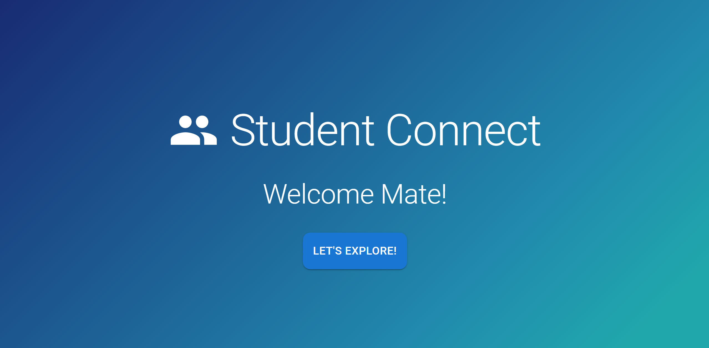
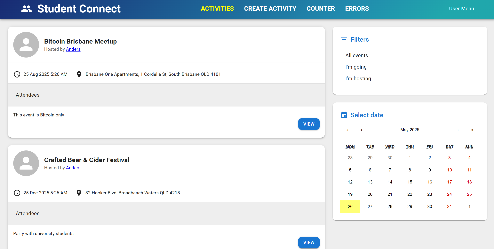
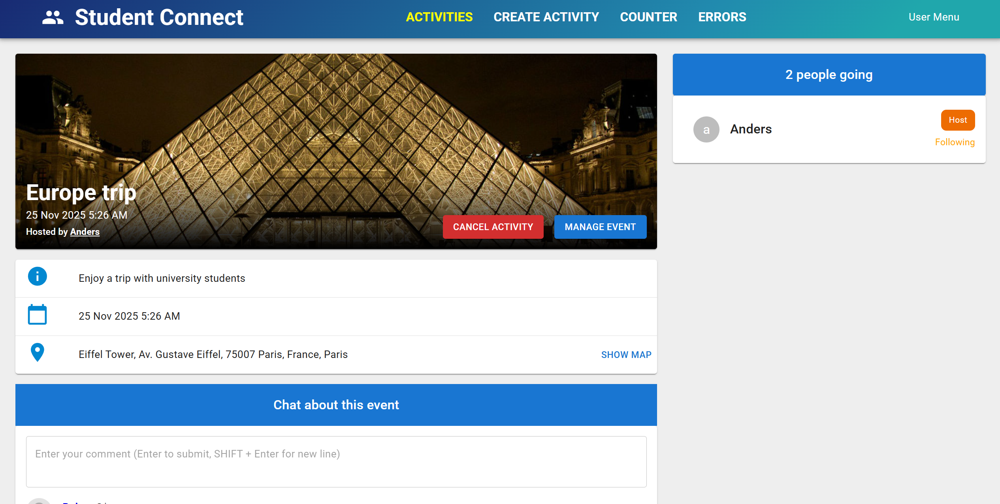
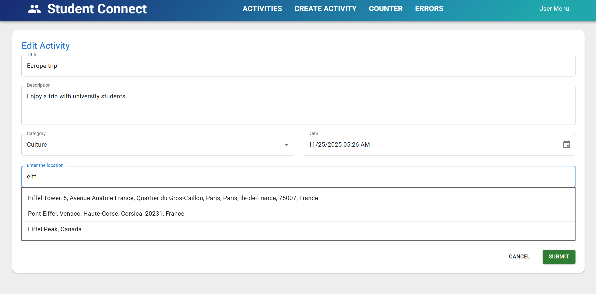

# StudentConnect

## Connecting Students Across Campuses

**StudentConnect** is a personal project born from a passion for learning React and .NET, and a desire to solve a real-world problem for students. This social media application aims to be a dedicated platform for students from diverse universities to connect, collaborate, and interact.

### The Challenge for Students Today

As a student, I've experienced firsthand the difficulties in connecting with peers beyond my immediate circles for various activities:

*   **Finding Event Buddies:** Navigating numerous, often cluttered and spam-filled Facebook groups to find people for events is a hassle. It's hard to find active groups with genuine members.
*   **Collaborating on Career Development:** Students are often looking for peers to work on projects, study together, or share career advice, but a centralized platform for this is missing.
*   **Trading and Selling Items:** When friends want to sell textbooks, furniture, or other items to fellow students at reasonable prices, they struggle to find an effective, targeted marketplace beyond inactive social media groups.

The core issue is clear: **University students need a dedicated, trustworthy, and engaging space to connect with others, both within their own university and with students from other institutions.**

### My Solution: StudentConnect

StudentConnect aims to be that space! It's being built to provide a focused environment where students can:

*   **Current Focus:** Hang Out & Network- Organise or join meetups, study groups, or social gatherings.
*   Upcoming: Career Growth- Collaborate on projects, share internship opportunities, and support each other's professional development.
*   Upcoming: Student Marketplace- A safe and easy way to buy, sell, or trade items with other students.

### Project Status

Currently under active development as a self-learning project.

<table>
  <tr>
    <td></td>
    <td></td>
  </tr>
</table>

<table>
  <tr>
    <td></td>
    <td></td>
  </tr>
</table>

### Tech Stack

**Frontend:** React (TypeScript)
*   **Vite:** Configured to run the development server on port 3000. Included mkcert to enable HTTPS for local development to mimick a production environment more closely.
*   **React Router:** In this Single Page Application, React Router handles navigation between different views without full page reloads. It improves user experience by updating necessary data and re-renders necessary views only. NavLink is used to detect active state of links for styling navigation bar to indicate the current page.
*   **React Query:** It handles fetching, automatic caching, synchronising and updating server data in client side with significant reduction in boilerplate. useQuery handles fetching all and single activities, caches them and only sends request to server again when data is stale or invalidated. useMutation handles creating, updating and deleting an activity. It invalidates data so useQuery will be triggered to refetch all activities.
*   **Axios:** It makes API requests from the browser to the backend. It automatically parses JSON data, intercepts request and response to set loading state and handles error through toast or navigating to error page.
*   **MobX:** It is used to manage Loading bar by making isLoading an observable with methods to set it true or false. It provides a clean way to re-render LinearProgress according to observable by wrapping it under the observer Higher Order Component.
*   **Context API:** Instead of doing prop drilling, create context of MobX store, then wrap the entire application under Context.Provider allows the MobX store accessible to all components in it. Calling useContext allows any component to access MobX store which is a dependency injection.
*   **Zod**: It defines a schema for validating user inputs. React-Hook-Form then checks users inputs against zod schema defined to ensure data matches rules before the form can be submitted.

**Backend:** .NET (C#)
*   **Clean Architecture:** It is domain centric and sets inner layers to be independent of external layers. Domain Layer (most inner) is independent of other layers and it contains business entities. Persistence layer handles saving and fetching objects from database. It depends on Domain layer. Application layer handles application logic (use cases), it depends on Domain and Persistence layers. It interacts with the database by injecting dependency from Persistence layer.  API layer handles HTTP requests and contains controllers, it depends on Application and Domain layer. In doing so, changing external layers like UI framework or Database won't affect business entities. It allows the app become scalable and maintanable. 
*   **CQRS:** It separates operations into Queries (read data) and Commands (write data) to simplify business logic.
*   **Controllers:** Middleware processes the request to controller then controller sends them to Mediator and returns HTTP responses.
*   **Mediator Pattern:** Mediator decouples API controllers from the application logic handles. Whenever a HTTP request comes in, controllers will send command or query objects to Mediator. Mediator will then go through its pipeline to validate data received before dispatching the handler.
*   **Fluent Validation:** It defines validation rules and validates data against rules set before passing to the command handlers.
*   **AutoMapper:** It automatically maps source object to destination object, so data is in the right format before saving while significantly reducing boilerplates.
*   **Entity Framework Core:** It is an Object Relational Mapper that translates LINQ queries into SQL commands to interact with the database. It maps business entities to database tables and speeds up development.
*   **Middleware:** It chains middleware components together to form middleware pipeline to handle HTTP requests. When a result is returned by the Controller, it will propagate upwards in middleware pipeline until the top. Then .NET will send it to the client.
*   **CORS:** It allows frontend to send requests with any header and method to the server.
*   **Postman:** It is for testing API.

**Styling:** Material-UI
  
### Upcoming Features
- Identity
- Client login and register
- Configuration of Entity Framework Relationships
- Client side attendance feature
- API Image upload
- Client Image upload
- SignalR
- Comment and Follow feature
- Paging, Sorting, Filtering
- Connect to Sql Server
- Deploy to Azure
- Identity Cookbook
- Only users with email that ends with .edu.au can register.
