# StudentConnect

## Connecting Students Across Universities

**StudentConnect** is my personal full-stack project, built with React (TypeScript) and .NET, aiming to solve the problem of how hard it is for Australian university students to find genuine events and connect with others across campuses. I started this because I found social media groups messy, full of spam, and not really designed for students to actually meet up, join events, or work on projects together.

### The Challenge

- **Finding Event Buddies:** It’s impossible to find active, real people to go to events with social media groups are all spam.
- **Collaborating:** There’s nowhere to find other students for projects, competitions, or just to hang out, unless you already have a big network.

### My Solution: StudentConnect

It's being built to provide a focused environment where students can **Hang out & Network** – Organise or join professional and social events, competitions, or gatherings.

### Project Status

Still under active development (I’m learning as I build it!).  
Here are some screenshots from the app:

<table>
  <tr align="center">
    <td>
Home Screen
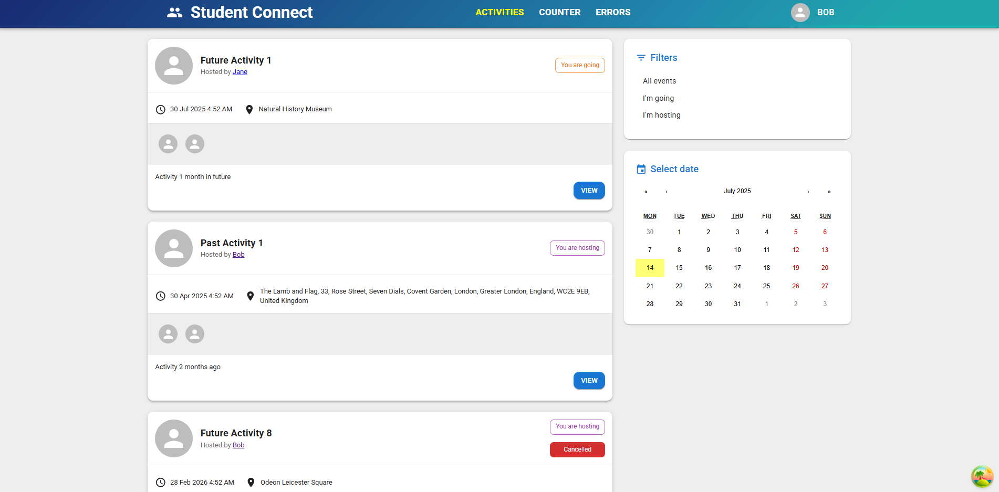</td>
  </tr>
</table>

<table>
  <tr align="center">
    <td>
Profile Hovering
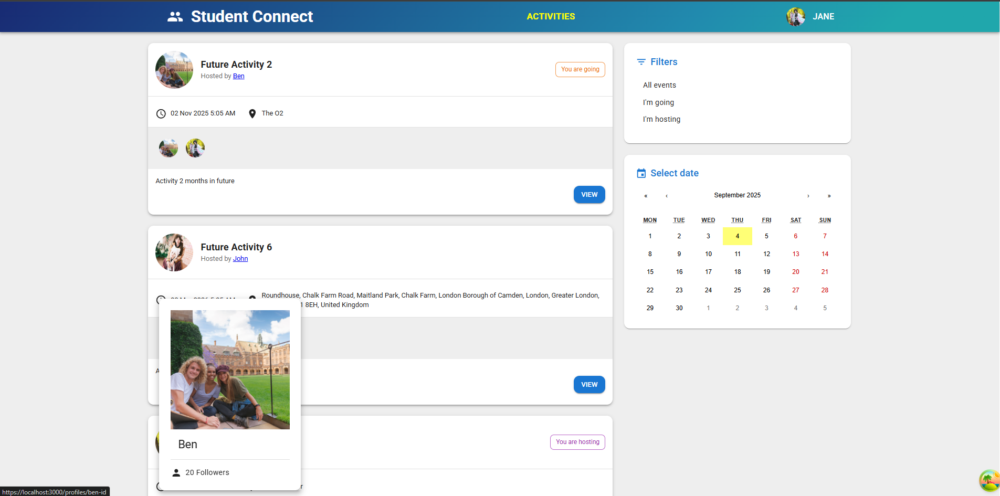</td>
  </tr>
</table>

<table>
  <tr align="center">
    <td>
Splash Screen
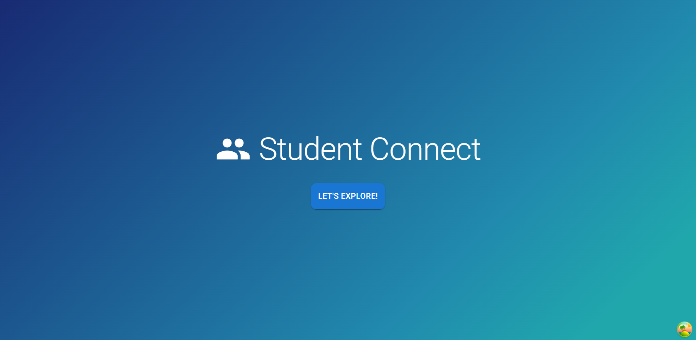</td>
  </tr>
</table>

<table>
  <tr align="center">
    <td>
Activity Host Screen
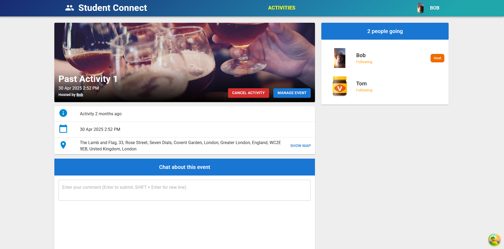</td>
    <td>
Activity Host Screen (After cancelling)
</td>
  </tr>
</table>

<table>
  <tr align="center">
    <td>
SignalR WebSocket Live Comment
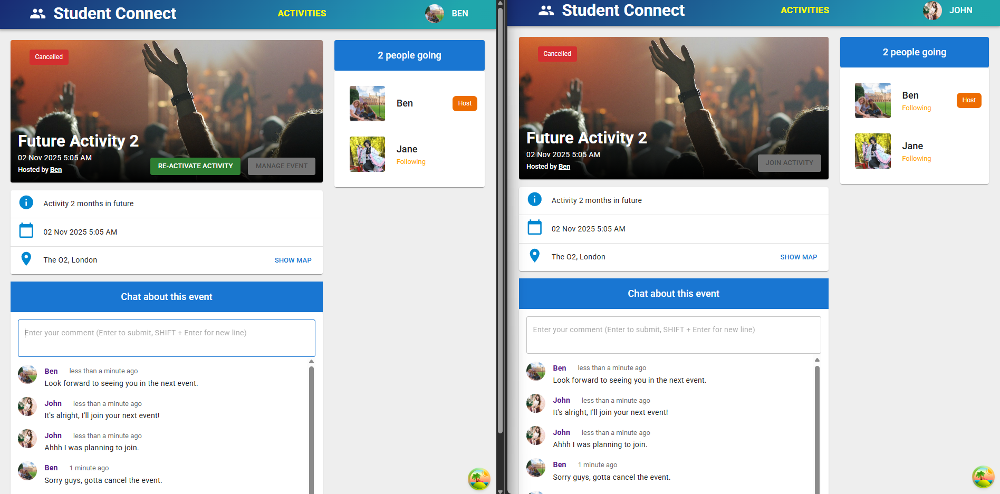</td>
  </tr>
</table>

<table>
  <tr align="center">
    <td>
Profile Page with Set Profile Picture and Delete features
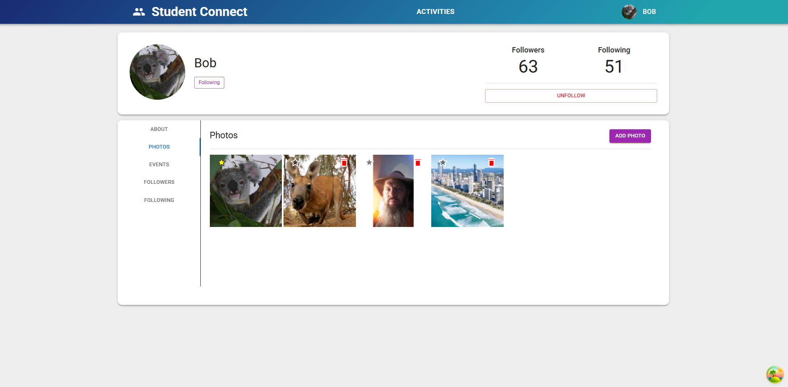</td>
  </tr>
</table>

<table>
  <tr align="center">
    <td>
Add/ Crop/ Upload Photo in Profile Page using React Dropzone and Cropper
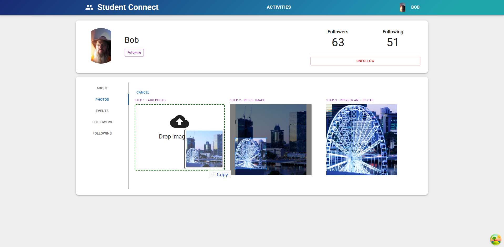</td>
  </tr>
</table>

<table>
  <tr align="center">
    <td>
Activity Attendee Screen (Before joining)
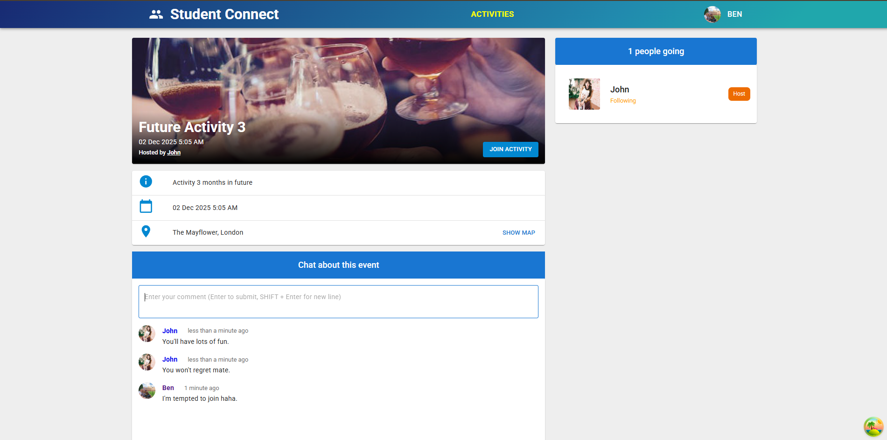</td>
    <td>
Activity Attendee Screen (After joining)
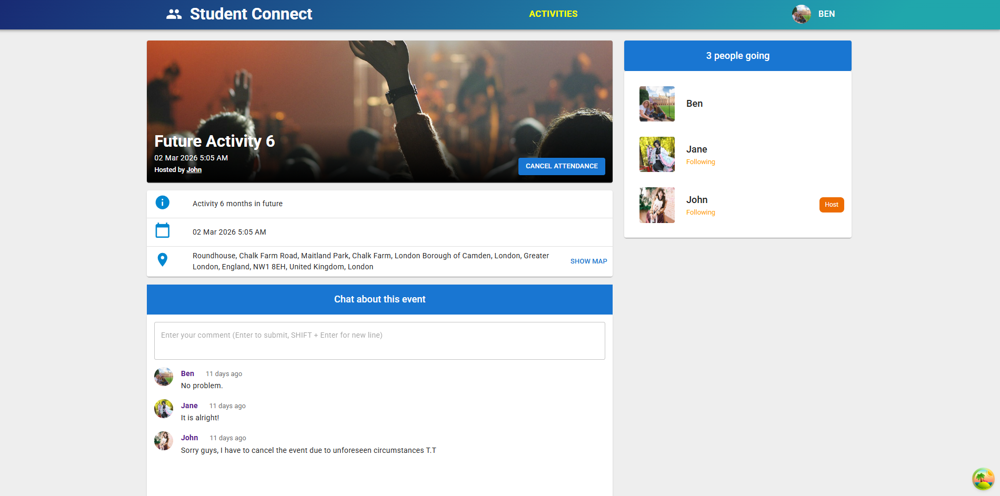</td>
  </tr>
</table>

<table>
  <tr align="center">
    <td>
Edit Activity Form
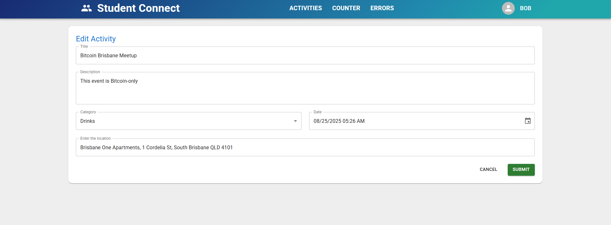</td>
    <td>
Create Activity Form
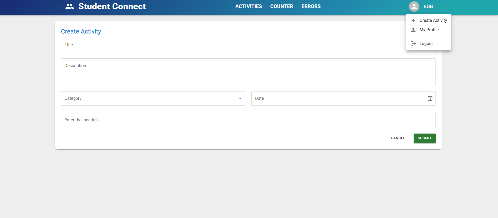</td>
  </tr>
</table>

<table>
  <tr align="center">
    <td>
Not Found Error
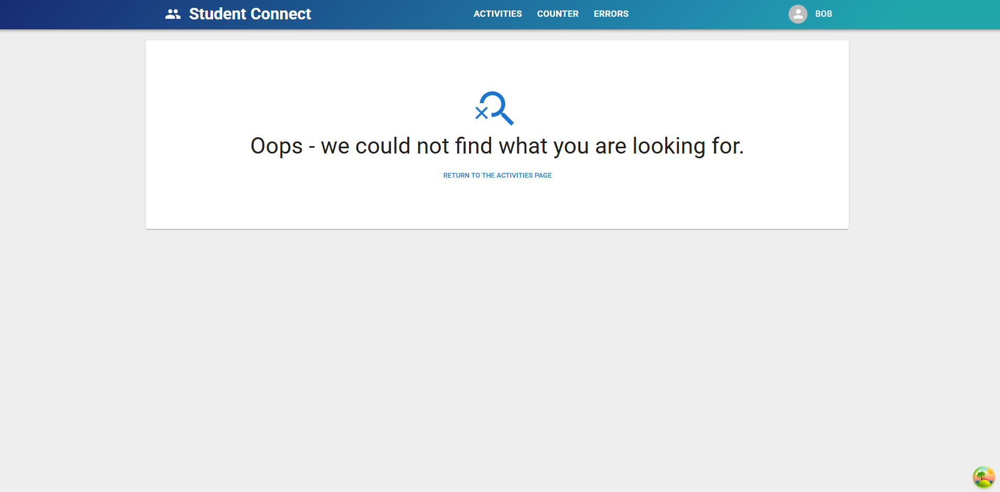</td>
    <td>
Wrong Sign In Credentials
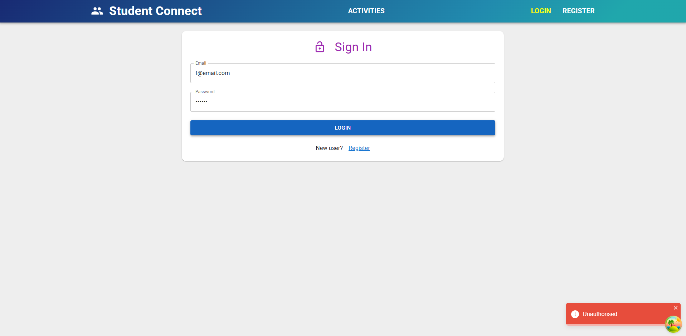</td>
  </tr>
</table>

<table>
  <tr align="center">
    <td>
Form Input Validation and Address Auto Completion
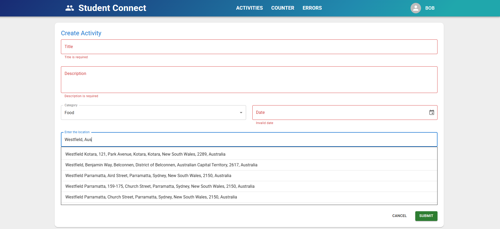</td>
    <td>
Registration Validation
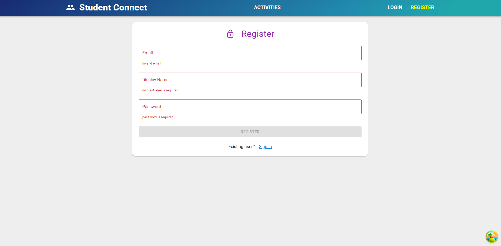</td>
  </tr>
</table>

<table>
  <tr align="center">
    <td>
Sign In Form Validation
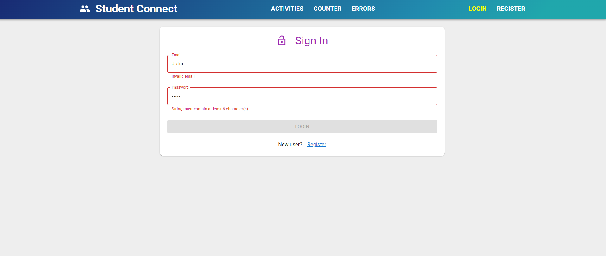</td>
    <td>
Complex Password Validation
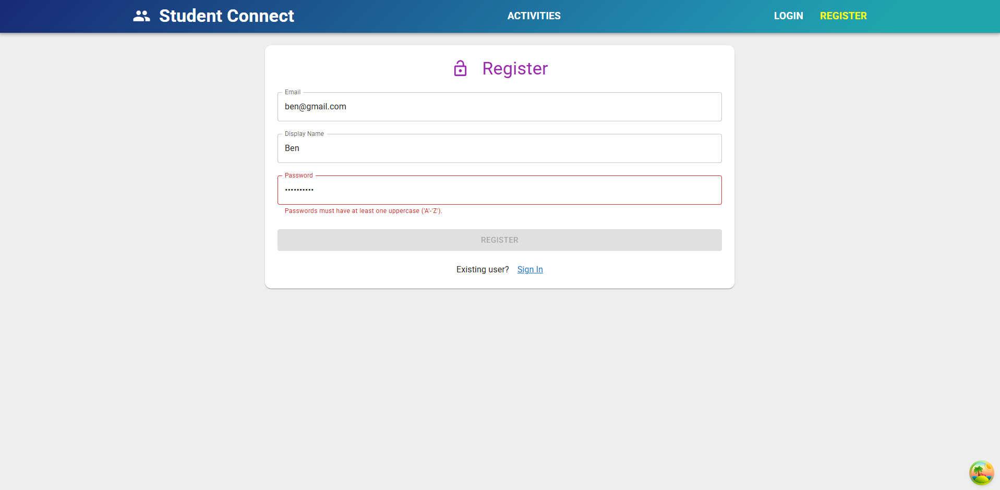</td>
  </tr>
</table>

## Main Features & Tech (with Project Context)

### Real-time Comments with SignalR

- I use **SignalR** (with `@microsoft/signalr` on the frontend and a custom `CommentHub` in the backend) to enable live chatting on each event.
- When you open an event, the app sets up a persistent SignalR connection tied to that event’s ID. All users viewing that event join the same group in the backend.
- If someone sends a comment, it’s sent straight to everyone else’s browser in real time—no need to refresh.
- The connection is managed by my custom React hook (`useComments.ts`), which handles joining/leaving, reconnection, and listening for both the “LoadComments” (existing comments) and “ReceiveComment” (new comment) events.
- The chat UI is in the `ActivityDetailsChat.tsx` file, with keyboard shortcuts (Enter to send, Shift+Enter for new line).

### Photo Uploads & Transformation with Cloudinary

- Profile and event photos are stored in **Cloudinary** via my own backend photo service (`PhotoService.cs`, using `CloudinaryDotNet`).
- When you upload a photo, it’s sent to Cloudinary, which saves, transforms, and returns a URL.
- Photos are always optimised for the right size and device. For example, in the profile photo gallery (`ProfilePhotos.tsx`), the Cloudinary URL is transformed to crop and compress the image for fast loading and better quality on any screen.
- Deleting photos is also fully wired—when you delete a profile photo, my backend deletes it from both Cloudinary and the database, making sure you can’t accidentally delete your main profile pic.

### Events & Activities

- Creating, editing, and deleting events is all handled using forms powered by **React-Hook-Form** and **Zod** for schema validation. The form structure matches my backend DTOs for consistency.
- Each event has a category (like Drinks, Culture, Film, etc.), location (with real-time search using LocationIQ), and date/time.
- The dashboard allows filtering events by type (all, going, hosting) and by date, using a calendar component.
- Deleting or editing events triggers backend logic to update the database and notifies other users if needed.

### Profiles & Social Features

- Each user has a profile page with a gallery of their photos, basic info, and (coming soon) lists of events they’re joining or hosting.
- You can see followers/following (UI built, backend logic in progress).
- Custom popover on hover for profile images, showing a quick profile card.

### Other Key Tools & Patterns (used specifically in this project)

- **MobX** for state management, especially for things like loading bars and chat updates.
- **Axios** for all API calls, handling loading/error states globally and showing toasts or error pages.
- **Material-UI** for all the UI components.
- **CQRS and Mediator Pattern** (with MediatR) in .NET API for clear separation of commands and queries.
- **FluentValidation** for all API-side validation (matching Zod schemas on the frontend).
- **AutoMapper** for mapping between backend entities and DTOs.
- **EF Core** with SQLite for database access.
- **Clean Architecture**: Domain (business logic), Application (use cases), Persistence (EF), Infrastructure (external services like Cloudinary), API (controllers).

---

## Upcoming Features

- Follow/Unfollow logic fully working (UI is done)
- Event paging, sorting, filtering
- Deploy to Azure
- Allow only .edu.au emails to register

---

## Running Locally

- Backend: .NET 9, SQLite, see `API/Program.cs` for service wiring (SignalR, Cloudinary, etc).
- Frontend: Vite + React + TypeScript, see `client/` for all source, and `.env.development` for API URLs.

---

## Why I Built This

I wanted a real, practical way for students (including myself) to actually meet up, join groups, and make friends, without relying on messy Facebook groups.  
I’ve tried to write the code and documentation so that anyone (including me in the future!) can understand how and why each tool is used, with all logic explained in code comments.

---
